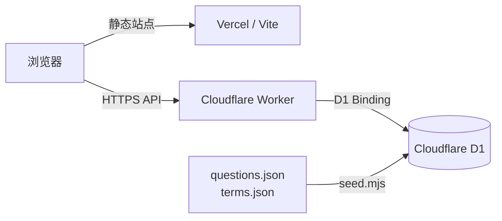

# CIPT Quiz System V2.1

面向中文学习者的 CIPT 中英双语刷题系统。V2.1 将页面、题库和学习数据完全解耦，前端可部署到 Vercel，API 与 SQLite 兼容数据存储运行在 Cloudflare Workers + D1。

## V2.1 架构



- `index.html`：纯页面结构，不包含题库或业务逻辑
- `styles.css`：响应式界面样式
- `app.js`：答题交互、API 调用与少量本机界面偏好
- `api-worker.js`：Cloudflare Worker REST API
- `questions.json` / `terms.json`：可维护的原始题库数据
- `schema.sql`：D1 / SQLite 表结构和索引
- `seed.mjs`：把 JSON 题库生成可导入 D1 的 `seed.sql`
- `vite.config.js` / `vercel.json`：Vercel 前端构建配置
- `wrangler.toml`：Worker 与 D1 Binding 配置

## 功能

- 中英双语题干与选项，可切换学习模式 / 自测模式
- 长句拆解、逻辑词提示、题内关键词解释
- 服务端判题，提交后返回解析、排除思路和记忆点
- 答题次数、最后答案、正确率、把握程度、错题和收藏持久化到 D1
- 按知识域筛选、随机练习、错题集中复习
- 中英文术语搜索
- 匿名学习 ID，无需注册、姓名或邮箱
- 云端进度 JSON 导入 / 导出
- 电脑和手机响应式布局、键盘快捷键

## 本地开发

要求 Node.js 20.19 或更高版本。

```bash
npm install
npm run db:local:setup
```

开启两个终端：

```bash
# 终端 1：Cloudflare Worker + 本地 SQLite
npm run dev:api

# 终端 2：Vite 前端
npm run dev
```

访问 `http://localhost:5173`。Vite 会把 `/api` 代理到 `http://127.0.0.1:8787`，本地 D1 数据保存在 `.wrangler/` 中。

## 部署 Cloudflare Worker + D1

### 1. 登录并创建 D1

```bash
npx wrangler login
npx wrangler d1 create cipt-quiz
```

把命令返回的 `database_id` 写入 `wrangler.toml`，替换全零占位值。

### 2. 初始化远程数据库

```bash
npm run db:remote:setup
```

### 3. 配置允许的 Vercel 域名

在 `wrangler.toml` 中将 `ALLOWED_ORIGINS` 改为实际前端域名。多个域名用英文逗号分隔，例如：

```toml
ALLOWED_ORIGINS = "https://super-quiz.vercel.app,https://quiz.example.com"
```

### 4. 部署 API

```bash
npm run deploy:api
```

记录输出的 `https://...workers.dev` 地址。

## 部署 Vercel 前端

导入本 GitHub 仓库后，在 Vercel 项目中设置：

| 配置项 | 值 |
| --- | --- |
| Framework Preset | Vite |
| Build Command | `npm run build` |
| Output Directory | `dist` |
| 环境变量 | `VITE_API_BASE_URL=https://你的-worker.workers.dev` |

重新部署后，浏览器会从 Vercel 加载页面，并通过 HTTPS 访问 Cloudflare Worker 与 D1。

## API

| 方法 | 路径 | 用途 |
| --- | --- | --- |
| `GET` | `/api/health` | 健康检查与题目数量 |
| `GET` | `/api/bootstrap?learnerId=...` | 一次加载题目、术语和进度 |
| `GET` | `/api/questions` | 获取不含答案的题目 |
| `GET` | `/api/glossary` | 获取术语库 |
| `POST` | `/api/attempts` | 提交答案并返回判题解析 |
| `PUT` | `/api/favorites/:learnerId/:questionId` | 更新收藏状态 |
| `GET` / `DELETE` | `/api/progress/:learnerId` | 获取或清空进度 |
| `POST` | `/api/progress/:learnerId/import` | 导入进度备份 |

## 题库维护

编辑 `questions.json` 和 `terms.json` 后重新生成并导入：

```bash
npm run seed:sql
npx wrangler d1 execute cipt-quiz --remote --file=seed.sql
```

V2.1 内置 24 道原创 CIPT 风格练习题和 30 个常用术语，用于学习和演示，不是 IAPP 官方试题，也不代表真实考试内容。

> CIPT 和 IAPP 是其各自权利人的商标。本项目与 IAPP 无隶属或背书关系。

## 安全与数据边界

- 正确答案和解析只在提交答案后由 API 返回。
- D1 使用参数化查询，前端不保存数据库凭据。
- `learnerId` 是浏览器生成的随机匿名标识，不等同于账户认证。知道该标识的人可能读取对应进度，因此 V2.1 不应保存敏感个人数据。
- 生产环境应限制 `ALLOWED_ORIGINS`，不要使用 `*`。

## License

Apache-2.0
